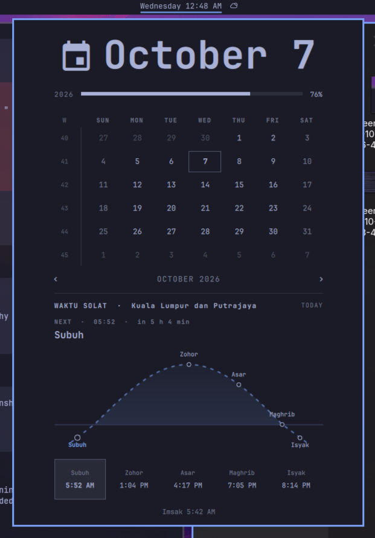

# Waktu Solat Clock for Omarchy

<table>
  <tr>
    <td width="42%" valign="top"></td>
    <td valign="top">
      <p>An Omarchy shell clock plugin with the stock calendar popup plus today's five prayer times and Imsak from <strong>JAKIM e-Solat</strong>. The prayer panel plots the five prayers along a sun-path timeline: Maghrib marks the sunset horizon, Zohor and Asar sit on the daytime arc, and Subuh and Isyak appear below the horizon. Sunrise is used to shape the arc but is not shown as a prayer marker. The elapsed part of the curve is solid and past prayers have filled dots; the upcoming part is dashed with outlined dots. A dot follows the current time; the next fard prayer and its countdown update each minute (after Isyak, the countdown points to tomorrow's Subuh). The arc is a visual interpolation between sunrise and sunset, not an astronomical sun-altitude calculation. The bar clock and prayer cards display in 12-hour format with AM/PM; the NEXT heading uses <code>HH:MM</code>. The calendar's controls, clock shortcuts, and bar integration are inherited from Omarchy's <code>omarchy.clock</code> plugin.</p>
      <p>For the Omarchy Quattro shell. Default zone: <code>WLY01</code> (Kuala Lumpur/Putrajaya). Prayer times always refer to <strong>today</strong> in your system time zone, even when browsing other calendar months; set the machine's time zone to Malaysia (<code>Asia/Kuala_Lumpur</code>) for correct day and next-prayer highlighting. Times are fetched on first open, on day/zone change, and retried on reopening or by clicking the error message. The last successful fetch is cached for the day. Requires <code>curl</code> and network access to <a href="https://www.e-solat.gov.my/">JAKIM e-Solat</a>; no API key is needed.</p>
    </td>
  </tr>
</table>

## Install

```sh
omarchy plugin add https://github.com/nurfaizfoat/waktu-solat-omarchy.git --enable
```

If it does not appear in the bar, use Omarchy's bar widget settings to add `nurfaizfoat.clock` in place of `omarchy.clock`. Do not keep both clocks in the bar. The `omarchy.clonedFrom` metadata tells Omarchy which built-in clock this replaces and preserves stock-clock shortcut routing.

Click the clock to open the calendar and prayer times. Right-click cycles clock formats; middle-click opens timezone selection. To change the prayer zone, use the bar widget settings or set `"zone": "<JAKIM zone code>"` on the `nurfaizfoat.clock` entry in `~/.config/omarchy/shell.json` (for example, `"zone": "WLY01"`). The prayer zone is separate from the system timezone.

### JAKIM prayer zones

Choose the code covering your location from [JAKIM's official zone list](https://www.e-solat.gov.my/index.php?siteId=24&pageId=24). The widget displays the full place name for `WLY01`; for other zones it displays the code while fetching that zone's times.

| State / territory | Code | Areas covered |
| --- | --- | --- |
| Johor | `JHR01` | Pulau Aur, Pulau Pemanggil |
| Johor | `JHR02` | Johor Bahru, Kota Tinggi, Mersing, Kulai |
| Johor | `JHR03` | Kluang, Pontian |
| Johor | `JHR04` | Batu Pahat, Muar, Segamat, Gemas Johor, Tangkak |
| Kedah | `KDH01` | Kota Setar, Kubang Pasu, Pokok Sena |
| Kedah | `KDH02` | Kuala Muda, Yan, Pendang |
| Kedah | `KDH03` | Padang Terap, Sik |
| Kedah | `KDH04` | Baling |
| Kedah | `KDH05` | Bandar Baharu, Kulim |
| Kedah | `KDH06` | Langkawi |
| Kedah | `KDH07` | Puncak Gunung Jerai |
| Kelantan | `KTN01` | Bachok, Kota Bharu, Machang, Pasir Mas, Pasir Puteh, Tanah Merah, Tumpat, Kuala Krai, Mukim Chiku |
| Kelantan | `KTN02` | Gua Musang (Galas dan Bertam), Jeli, Lojing |
| Melaka | `MLK01` | Entire state |
| Negeri Sembilan | `NGS01` | Tampin, Jempol |
| Negeri Sembilan | `NGS02` | Jelebu, Kuala Pilah, Rembau |
| Negeri Sembilan | `NGS03` | Port Dickson, Seremban |
| Pahang | `PHG01` | Pulau Tioman |
| Pahang | `PHG02` | Kuantan, Pekan, Muadzam Shah |
| Pahang | `PHG03` | Jerantut, Temerloh, Maran, Bera, Chenor, Jengka |
| Pahang | `PHG04` | Bentong, Lipis, Raub |
| Pahang | `PHG05` | Genting Sempah, Janda Baik, Bukit Tinggi |
| Pahang | `PHG06` | Cameron Highlands, Genting Highlands, Bukit Fraser |
| Pahang | `PHG07` | Rompin (Rompin, Endau and Pontian districts) |
| Perlis | `PLS01` | Kangar, Padang Besar, Arau |
| Pulau Pinang | `PNG01` | Entire state |
| Perak | `PRK01` | Tapah, Slim River, Tanjung Malim |
| Perak | `PRK02` | Kuala Kangsar, Sungai Siput, Ipoh, Batu Gajah, Kampar |
| Perak | `PRK03` | Lenggong, Pengkalan Hulu, Gerik |
| Perak | `PRK04` | Temengor, Belum |
| Perak | `PRK05` | Kampung Gajah, Teluk Intan, Bagan Datuk, Seri Iskandar, Beruas, Parit, Lumut, Sitiawan, Pulau Pangkor |
| Perak | `PRK06` | Selama, Taiping, Bagan Serai, Parit Buntar |
| Perak | `PRK07` | Bukit Larut |
| Sabah | `SBH01` | Sandakan (east), Bukit Garam, Semawang, Temanggong, Tambisan, Sukau |
| Sabah | `SBH02` | Beluran, Telupid, Pinangah, Terusan, Kuamut, Sandakan (west) |
| Sabah | `SBH03` | Lahad Datu, Silabukan, Kunak, Sahabat, Semporna, Tungku, Tawau (east) |
| Sabah | `SBH04` | Bandar Tawau, Balong, Merotai, Kalabakan, Tawau (west) |
| Sabah | `SBH05` | Kudat, Kota Marudu, Pitas, Pulau Banggi |
| Sabah | `SBH06` | Gunung Kinabalu |
| Sabah | `SBH07` | Kota Kinabalu, Ranau, Kota Belud, Tuaran, Penampang, Papar, Putatan |
| Sabah | `SBH08` | Pensiangan, Keningau, Tambunan, Nabawan, interior (upper) |
| Sabah | `SBH09` | Beaufort, Kuala Penyu, Sipitang, Tenom, Long Pasia, Membakut, Weston, interior (lower) |
| Selangor | `SGR01` | Gombak, Petaling, Sepang, Hulu Langat, Hulu Selangor, Shah Alam |
| Selangor | `SGR02` | Kuala Selangor, Sabak Bernam |
| Selangor | `SGR03` | Klang, Kuala Langat |
| Sarawak | `SWK01` | Limbang, Lawas, Sundar, Trusan |
| Sarawak | `SWK02` | Miri, Niah, Bekenu, Sibuti, Marudi |
| Sarawak | `SWK03` | Pandan, Belaga, Suai, Tatau, Sebauh, Bintulu |
| Sarawak | `SWK04` | Sibu, Mukah, Dalat, Song, Igan, Oya, Balingian, Kanowit, Kapit |
| Sarawak | `SWK05` | Sarikei, Matu, Julau, Rajang, Daro, Bintangor, Belawai |
| Sarawak | `SWK06` | Lubok Antu, Sri Aman, Roban, Debak, Kabong, Lingga, Engkelili, Betong, Spaoh, Pusa, Saratok |
| Sarawak | `SWK07` | Serian, Simunjan, Samarahan, Sebuyau, Meludam |
| Sarawak | `SWK08` | Kuching, Bau, Lundu, Sematan |
| Sarawak | `SWK09` | Kampung Patarikan (special zone) |
| Terengganu | `TRG01` | Kuala Terengganu, Marang, Kuala Nerus |
| Terengganu | `TRG02` | Besut, Setiu |
| Terengganu | `TRG03` | Hulu Terengganu |
| Terengganu | `TRG04` | Dungun, Kemaman |
| Kuala Lumpur & Putrajaya | `WLY01` | Kuala Lumpur, Putrajaya (default) |
| Labuan | `WLY02` | Labuan |

## Remove

```sh
omarchy plugin remove nurfaizfoat.clock
```

If you manually added the bar entry, remove it and restore `omarchy.clock` in the bar settings.

## Develop from this working directory

The local development copy lives at `~/Documents/waktu-solat-omarchy` and is linked from `~/.config/omarchy/plugins/nurfaizfoat.clock`. After editing the linked plugin, run `omarchy restart shell`: the shell's file watcher does not reliably reload already-mounted plugins through symlinks, even after `omarchy-shell shell rescanPlugins`.

## Develop and verify

```bash
omarchy plugin validate .
node test/prayer-times.test.cjs
omarchy restart shell
git status
```

`manifest.json`, `BarWidget.qml`, `Panel.qml`, `Model.js` and `PrayerTimes.js` are the distributable plugin. The date/time API is `https://www.e-solat.gov.my/index.php?r=esolatApi/takwimsolat&period=today&zone=WLY01`. No API response is checked into Git.

This project starts from [Omarchy's clock plugin](https://github.com/omacom/omarchy/tree/quattro/shell/plugins); `Model.js`, `BarWidget.qml`, and the calendar part of `Panel.qml` retain the upstream implementation. The project is licensed under [MIT](LICENSE), retaining upstream copyright. Keep an eye on changes to upstream `omarchy.clock` when updating Omarchy.

## How this version was built

1. Cloned the Omarchy clock plugin into a user-owned project, keeping its calendar and bar behavior.
2. Added daily JAKIM e-Solat fetching for the configured zone, a five-prayer display, Imsak, and the next-prayer countdown.
3. Added a time-scaled sunrise-to-sunset curve, with filled/solid elapsed markers and line, outlined/dashed upcoming markers and line. Sunrise shapes the arc but has no visible label or card.
4. Replaced the displayed `WLY01` code with “Kuala Lumpur dan Putrajaya” and moved the upcoming `HH:MM` time and countdown beside NEXT.
5. Tested the parser, timeline, sun-path math, and countdown under Node; validated the plugin, restarted the shell, and checked the rendered panel.
